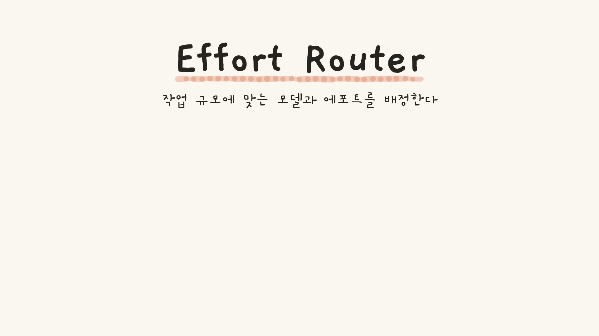

# README 삽입용 단편 (P4 산출)

루트 `README.md` 최상단(제목 아래)에 아래 코드블록 내용을 그대로 붙여넣는다.
경로는 저장소 루트 기준 상대경로이며 데모·배포 URL은 일절 없다.

## 삽입 단편 (복붙용)

```markdown
[](docs/hero/build/hero.gif)

**Effort Router** — 작업 규모에 맞는 모델과 에포트를 배정한다. 이미지를 클릭하면 모션 GIF(960×540·24초·무한 루프)가 열린다.
```

## 미리보기 (위 단편이 실제로 렌더된 모습)

[](build/hero.gif)

**Effort Router** — 작업 규모에 맞는 모델과 에포트를 배정한다. 이미지를 클릭하면 모션 GIF(960×540·24초·무한 루프)가 열린다.

## 방식 선택 근거

- GIF 직삽입(``)도 GitHub에서 자동 재생되지만 7.24MB짜리 바이너리가 README 로드마다 뜨므로, 46KB 포스터를 썸네일로 보여주고 클릭 시 GIF로 이동하는 표준 패턴(위 단편)을 채택했다.
- 포스터는 t=23.95s(스왑 완료 후 — 마지막 프레임 479와 동일 구도)의 정지 화면이다. 타이틀·밑줄·태그라인이 모션 첫 장면(프레임 0)과 동일 구도라 썸네일 첫 인상이 곧 첫 장면이다.
- 이 파일 자체의 미리보기는 `docs/hero/` 내부 상대경로(`build/…`)를 쓰므로 이 문서 위치에서만 렌더된다. README에 붙여넣는 단편은 루트 기준(`docs/hero/build/…`)이다.
